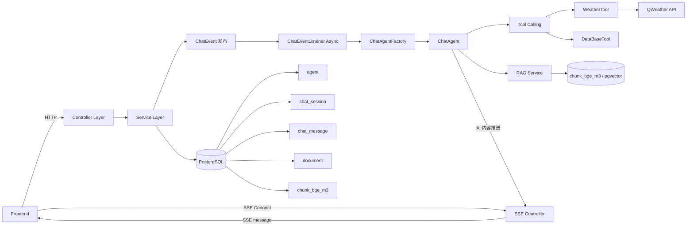

# J-RAGent Backend

一个面向工具调用与知识库检索的 Java 智能体后端，支持多模型对话、SSE 实时推送、文档上传解析、向量检索与 RAG 问答。

## 项目介绍

J-RAGent Backend 是一个基于 Spring Boot + Spring AI 的智能体服务端，核心能力包括：

- 多模型聊天（DeepSeek / ZhipuAI）
- Tool Calling（天气查询、数据库查询等）
- 文档上传与 Markdown 解析
- 向量化存储（PostgreSQL + pgvector）
- RAG 检索增强问答
- SSE 实时消息流推送
- OpenAPI/Knife4j 接口文档

## 技术栈

- ☕ **Java 17**
- 🍃 **Spring Boot 3.5.8**
- 🤖 **Spring AI 1.1.2**（DeepSeek / ZhipuAI）
- 🗃️ **PostgreSQL + pgvector**
- 🧩 **MyBatis 3.0.3**
- 🧰 **MapStruct 1.6.3 + Lombok**
- 📄 **Flexmark**（Markdown 解析）
- 📡 **SSE (SseEmitter)**
- 📚 **Knife4j + springdoc-openapi**
- 🪵 **Log4j2**

## 系统架构图



## 核心功能

- 智能体管理：创建、更新、删除、查询
- 会话管理：按 Agent 维度组织会话
- 消息管理：用户消息触发异步 Agent 推理流程
- 工具调用：支持固定/可选工具动态装配
- 文档上传：文件落盘 + 元数据入库
- Markdown 解析：分段后进入向量化流程
- RAG 检索：按知识库召回 chunk 支撑回答
- SSE 推送：支持心跳、重连替换与异常回收

## 快速开始

### 1. 准备环境变量

请在本地环境设置以下变量（示例）：

```bash
DB_URL=jdbc:postgresql://localhost:5432/jragent
DB_USERNAME=jragent
DB_PASSWORD=your_password

MAIL_USERNAME=your_mail
MAIL_PASSWORD=your_mail_token

DEEPSEEK_API_KEY=your_deepseek_key
ZHIPUAI_API_KEY=your_zhipu_key

X_QW_API_HOST=your_qweather_host
X_QW_API_KEY=your_qweather_key
```

### 2. 初始化数据库

- 创建 PostgreSQL 数据库
- 启用 pgvector 扩展：

```sql
CREATE EXTENSION IF NOT EXISTS vector;
```

- 执行项目中的建表 SQL（`to/` 目录）

### 3. 启动项目

```bash
./mvnw spring-boot:run
```

Windows:

```bash
mvnw.cmd spring-boot:run
```

### 4. 查看接口文档

- Knife4j: `http://localhost:8080/doc.html`
- Swagger UI: `http://localhost:8080/swagger-ui/index.html`

## 环境要求

- JDK 17+
- Maven 3.9+
- PostgreSQL 14+（建议）
- pgvector 扩展
- 可访问外部模型与天气 API 的网络环境

---

如需联调建议，可优先走：

1. 创建 Agent
2. 创建 Chat Session
3. 建立 SSE 连接
4. 发送用户消息触发工具链与 RAG
